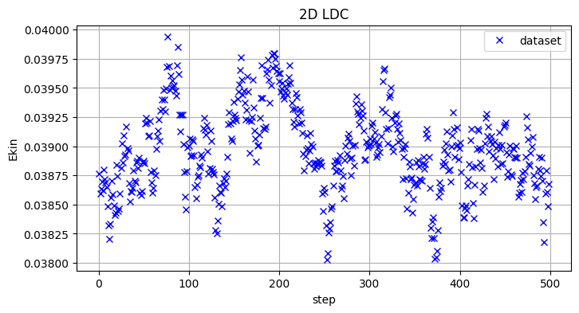
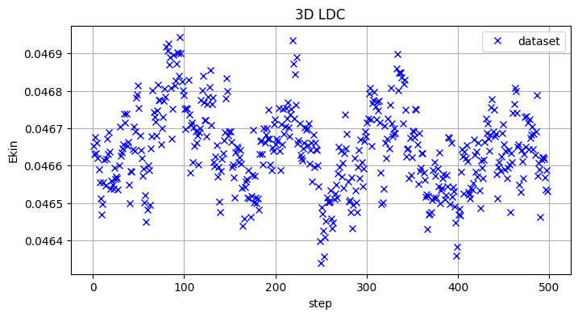
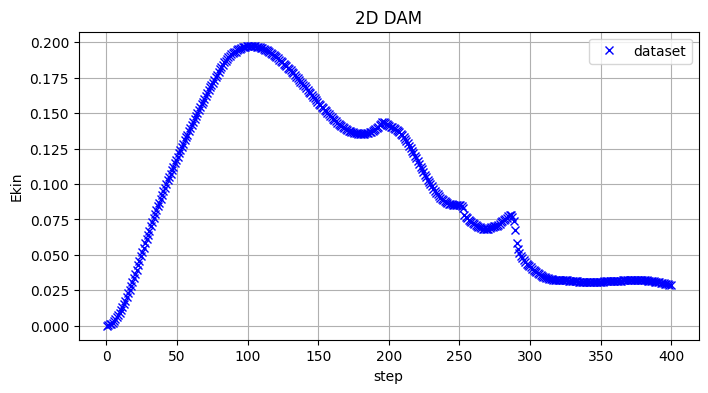
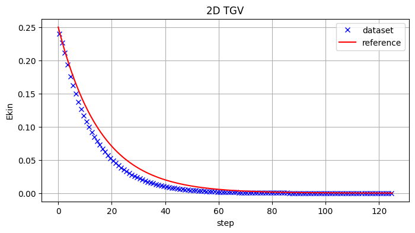
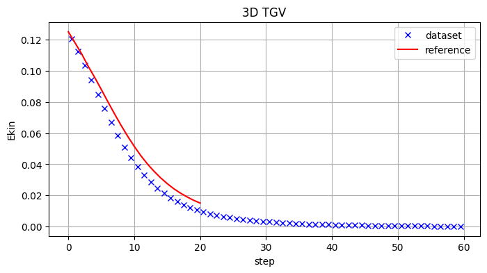

LagrangeBench Datasets
======================

This is an overview of the introduced datasets. We show:

-  Dataset animations.
-  Evaluation of physical properties.

The structure of all datasets is the same and consists of four files: -
``metadata.json`` - the data needed to set up the numerical solver and
simulate trajectories - ``train.h5`` - training set - ``valid.h5`` -
validation set - ``test.h5`` - test set

.. code:: ipython3

    import os
    os.environ["CUDA_VISIBLE_DEVICES"] = ""
    
    import numpy as np
    from jax import vmap
    from jax_md import space
    import matplotlib.pyplot as plt
    
    import lagrangebench
    
    plt.rcParams.update({'font.size': 10})

Dataset animations
------------------

We animate a few consecutive frames from our datasets using
`ParaView <https://www.paraview.org/>`__ and color the particles by the
magnitude of their velocity.

-  Reverse Poiseuille Flow

   |rpf2d.gif| |rpf3d.gif|

-  Taylor Green Vortex

   |tgv2d.gif| |tgv3d.gif|

-  Lid-Driven Cavity

   |ldc2d.gif| |ldc3d.gif|

-  Dam Break

   .. figure:: https://s11.gifyu.com/images/SceKB.gif
      :alt: dam2d.gif

      dam2d.gif

.. |rpf2d.gif| image:: https://s11.gifyu.com/images/Sce92.gif
.. |rpf3d.gif| image:: https://s11.gifyu.com/images/Sce3X.gif
.. |tgv2d.gif| image:: https://s11.gifyu.com/images/Sce9b.gif
.. |tgv3d.gif| image:: https://s11.gifyu.com/images/Sce9z.gif
.. |ldc2d.gif| image:: https://s11.gifyu.com/images/Sce9S.gif
.. |ldc3d.gif| image:: https://s11.gifyu.com/images/Sce3e.gif

Dataset shapes
--------------

Short script to check the shapes of the raw validation datasets.

If you haven’t downloaded the datasets yet, you can do so by running
this script from the root of the repository:

.. code:: bash

   bash download_data.sh all notebooks/datasets/

.. code:: ipython3

    import os.path as osp
    import h5py
    
    # the datasets are stored in the following directories, whose names follow the convention:
    # {dim}_{case}_{num_particles_max}_{num_steps}every{sampling_rate}
    # dim - dimension. One of {2D|3D}.
    # case - simulation case. One of {TGV|RPF|LDC|DAM}.
    # num_particles_max - maximum number of particles in the dataset.
    # num_steps - number of position frames in the training split of the dataset.
    # sampling_rate - sampling_rate=100 means that the position frames correspond to every
    #     100th SPH simulation step.
    path = [
        "2D_TGV_2500_10kevery100",
        "2D_RPF_3200_20kevery100",
        "2D_LDC_2708_10kevery100",
        "2D_DAM_5740_20kevery100",
        "3D_TGV_8000_10kevery100",        
        "3D_RPF_8000_10kevery100",
        "3D_LDC_8160_10kevery100",
    ]
    
    # 6 history positions (5 past velocities) + 20-step rollout
    valid_seq_length = 6 + 20  # during validation and inference
    dataset_root = "datasets/"
    split = "valid.h5"
    
    for p in path:
        p = osp.join(dataset_root, p, split)
        with h5py.File(p, "r") as f:
            pos_shape =  f["00000/position"].shape
            split_into = pos_shape[0]//valid_seq_length
            num_trajs = len(list(f.keys()))
            print(f"{p[9:]}, traj_shape= {str(pos_shape):<20}, "
                  f"split_valid_traj_into_n= {split_into:<5}, "
                  f"num_trajs: {num_trajs:<5}, "
                  f"eval_n_trajs_infer: {split_into * num_trajs}")

.. parsed-literal::

    2D_TGV_2500_10kevery100/valid.h5, traj_shape= (126, 2500, 2)      , split_valid_traj_into_n= 4    , num_trajs: 50   , eval_n_trajs_infer: 200
    2D_RPF_3200_20kevery100/valid.h5, traj_shape= (10001, 3200, 2)    , split_valid_traj_into_n= 384  , num_trajs: 1    , eval_n_trajs_infer: 384
    2D_LDC_2708_10kevery100/valid.h5, traj_shape= (5001, 2708, 2)     , split_valid_traj_into_n= 192  , num_trajs: 1    , eval_n_trajs_infer: 192
    2D_DAM_5740_20kevery100/valid.h5, traj_shape= (401, 5740, 2)      , split_valid_traj_into_n= 15   , num_trajs: 25   , eval_n_trajs_infer: 375
    3D_TGV_8000_10kevery100/valid.h5, traj_shape= (61, 8000, 3)       , split_valid_traj_into_n= 2    , num_trajs: 100  , eval_n_trajs_infer: 200
    3D_RPF_8000_10kevery100/valid.h5, traj_shape= (5001, 8000, 3)     , split_valid_traj_into_n= 192  , num_trajs: 1    , eval_n_trajs_infer: 192
    3D_LDC_8160_10kevery100/valid.h5, traj_shape= (5001, 8160, 3)     , split_valid_traj_into_n= 192  , num_trajs: 1    , eval_n_trajs_infer: 192

Evaluation of physical properties
---------------------------------

Here we focus on the kinetic energy as a measure of physical behaviour.
We distinguish two cases:

1. Statistically stationary :math:`E_{kin}` (RPF and LDC) - the kinetic
   energy oscillates around an equilibrium value, and the oscillations
   are because of the finite number of particle used for the
   discretization.
2. Variable :math:`E_{kin}` (TGV, DAM) - In the TGV example it decays
   due to viscous interactions and in dam break it first increases by
   transfer of potential to kinetic energy, but then also decays due to
   viscosity.

.. code:: ipython3

    # utils
    
    def compute_kinetic_energy(metadata, traj):
        bounds = np.array(metadata["bounds"])
        displacement_fn, _ = space.periodic(side=bounds[:,1])
        displ_vmap = vmap(displacement_fn, (0, 0))
        displ_dvmap = vmap(displ_vmap, (0, 0))
    
        displacement = displ_dvmap(traj[:,1:], traj[:, :-1])
        vel = displacement / (metadata["dt"] * metadata["write_every"])
        vel = np.asarray(vel) # shape: (num_particles, num_steps, dim)
        square_absolute_velocity = (vel**2).sum(axis=2) # shape: (num_particles, num_steps)
        e_kin = 0.5 * square_absolute_velocity.mean(axis=(0,)) # shape: (num_steps,)
        return e_kin
    
    def plt_e_kin(dataset_path, seq_len, e_kin_ref=None):
        dim, name, _, _ = dataset_path.split('/')[1].split('_')
        
        dataset = lagrangebench.data.H5Dataset(
            "valid", 
            dataset_path=dataset_path,
            input_seq_length=seq_len,
            extra_seq_length=1,
        )
        traj, _ = dataset[0]
        e_kin = compute_kinetic_energy(dataset.metadata, traj)
            
        plt.figure(figsize=(8,4))
        plt.plot(np.arange(len(e_kin)) + 0.5, e_kin, 'xb', label='dataset')
        
        if e_kin_ref is not None:
            plt.plot(e_kin_ref, 'r', label='reference')
        
        plt.legend() 
        plt.grid()
        plt.title(f"{dim} {name}")
        plt.xlabel('step')
        plt.ylabel('Ekin')

RPF and LDC
~~~~~~~~~~~

.. code:: ipython3

    plt_e_kin("datasets/2D_RPF_3200_20kevery100", 500)

.. code:: ipython3

    plt_e_kin("datasets/3D_RPF_8000_10kevery100", 500)

.. code:: ipython3

    plt_e_kin("datasets/2D_LDC_2708_10kevery100", 500)

.. image:: media/datasets_10_0.png

.. code:: ipython3

    plt_e_kin("datasets/3D_LDC_8160_10kevery100", 500)

.. image:: media/datasets_11_0.png

DAM
~~~

.. code:: ipython3

    plt_e_kin("datasets/2D_DAM_5740_20kevery100", 400)

2D TGV
~~~~~~

The two dimensional Taylor-Green vortex has an analytical solution as
outlined in [1]. Here, we compare this solution of the kinetic energy
with the kinetic enery in one of our dataset trajectories.

[1] - Adami et al., `A transport-velocity formulation for smoothed
particle
hydrodynamics <https://www.sciencedirect.com/science/article/abs/pii/S002199911300096X>`__,
2013

.. code:: ipython3

    dataset_path = "datasets/2D_TGV_2500_10kevery100"
    dataset = lagrangebench.data.H5Dataset(
        "valid", 
        dataset_path=dataset_path,
        extra_seq_length=1,
    )
    
    dt_dataset = (dataset.metadata['dt'] * dataset.metadata['write_every'])
    len_traj = 1 + dataset.metadata['t_end'] / dt_dataset
    t = np.linspace(0, dataset.metadata['t_end'], int(len_traj)) # physical time axis
    
    rho_ref = 1. # reference density
    u_ref = 1. # reference velocity, i.e. u_max at t=0
    L_ref = 1. # reference length, i.e. domain size
    eta = dataset.metadata['viscosity'] # viscosity
    Re = rho_ref * u_ref * L_ref / eta # Reynolds number
    slope_u_max = - 8 * np.pi ** 2 / Re # analytical decay rate of max velocity
    # factor 0.25 = int(int((sin(2 pi x) cos(2 pi y))^2, x from 0 to 1), y from 0 to 1)
    e_kin_theory = 0.25 * np.exp(2 * slope_u_max * t) # analytical kinetic energy evolution

In the above we used information from the ``dataset.metadata`` which is
the content of a metadata file associated with each of our datasets. The
metadata file for 2D TGV looks like this:

.. code:: ipython3

    dataset.metadata

.. parsed-literal::

    {'case': 'TGV',
     'solver': 'SPH',
     'density_evolution': False,
     'dim': 2,
     'dx': 0.02,
     'dt': 0.0004,
     't_end': 5.0,
     'viscosity': 0.01,
     'p_bg_factor': 0.0,
     'g_ext_magnitude': 0.0,
     'artificial_alpha': 0.0,
     'free_slip': False,
     'write_every': 100,
     'is_bc_trick': False,
     'sequence_length_train': 126,
     'num_trajs_train': 100,
     'sequence_length_test': 126,
     'num_trajs_test': 50,
     'num_particles_max': 2500,
     'periodic_boundary_conditions': [True, True, True],
     'bounds': [[0.0, 1.0], [0.0, 1.0]],
     'default_connectivity_radius': 0.029,
     'vel_mean': [2.9928384037702926e-07, 5.485588872033986e-07],
     'vel_std': [0.006356782279908657, 0.006356848403811455],
     'acc_mean': [1.1536379524465599e-14, -1.9131170172353995e-13],
     'acc_std': [0.0008755344315432012, 0.0008755328599363565]}

.. code:: ipython3

    plt_e_kin(dataset_path, 125, e_kin_theory)

We don’t perfectly solve the 2D TGV, but this behaviour is a known
limitation of purely Lagrangian SPH, as shown in [1]. We remind the
reader that we restrict ourselves to purely Lagrangian schemes so that
we are able to recover the velocity of particles by computing the
difference between positions, something that is not valid with improved
semi-Lagrangian SPH schemes.

3D TGV
~~~~~~

The three dimensional Taylor Green system at Re=50 does not have an
analytical solution, but we run a high resolution reference simulation
with the `JAX-Fluids <https://github.com/tumaer/JAXFLUIDS>`__ solver and
store the values of the kinetic energy at seconds [0, 0.5, 1, 1.5, …
10].

Here, we again don’t perfectly recover the true solution, but the
initial rapid drop in kinetic energy on the 3D TGV is also a documented
limitatation of purely Lagrangian SPH, see [2]. And yet we are rather
close to the reference.

[2] - Adami et al., `Simulating three-dimensional turbulence with
SPH <https://mediatum.ub.tum.de/doc/1360487/978874575863.pdf>`__, 2012

.. code:: ipython3

    e_kin_ref = 0.001 * np.array([
        125, 118, 111, 103, 95.7, 88.0, 80.1, 72.4, 65, 58, 51.5,
        45.5, 40.2, 35.5, 31.3, 27.6, 24.3, 21.5, 19.1, 16.9, 15.1
    ])
    plt_e_kin("datasets/3D_TGV_8000_10kevery100", 59, e_kin_ref)

