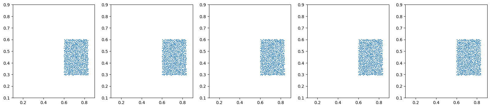
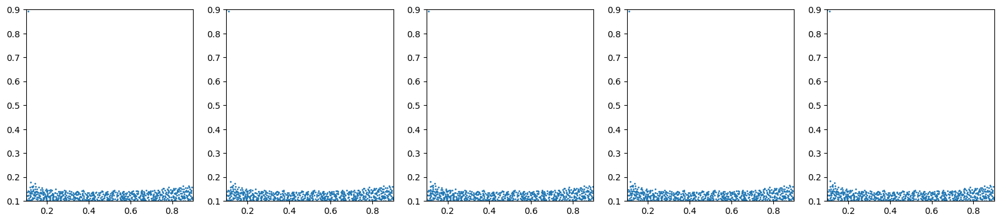
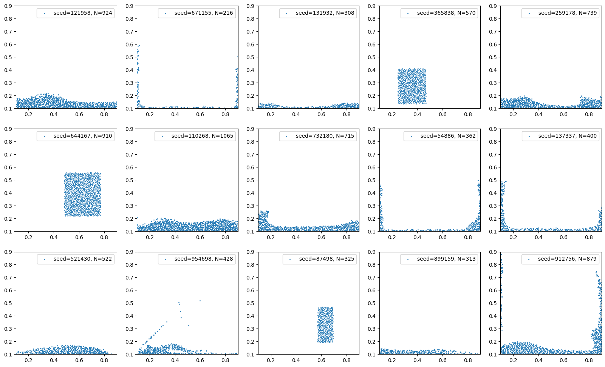

Working with other datasets
===========================

We demonstrate how to train a GNN on one of the datasets provided by
DeepMind along with the paper [1]. We divide this notebook into three
parts:

-  Download and preprocess
-  Inspect the data
-  GNN training

[1] - Sanchez-Gonzalez et al., `“Learning to Simulate Complex Physics
with Graph Networks” <https://arxiv.org/abs/2002.09405>`__, ICLR 2020

.. code:: ipython3

    import os
    os.environ["CUDA_VISIBLE_DEVICES"] = ""
    
    import lagrangebench
    import haiku as hk
    import numpy as np
    import matplotlib.pyplot as plt


Download and preprocess
-----------------------

The easiest was to download and preprocess the datasets from the GNS
paper is by following the instructions in
```gns_data/README.md`` <../gns_data/README.md>`__. For our
demonstration, we choose the 2D WaterDrop dataset.

Note: the size of this dataset is around 4.5GB.

.. code:: ipython3

    !mkdir -p ./datasets
    !bash ../gns_data/download_dataset.sh WaterDrop ./datasets


.. parsed-literal::

    --2023-10-15 01:39:30--  https://storage.googleapis.com/learning-to-simulate-complex-physics/Datasets/WaterDrop/metadata.json
    Resolving storage.googleapis.com (storage.googleapis.com)... 142.250.186.91, 172.217.18.27, 142.250.186.59, ...
    Connecting to storage.googleapis.com (storage.googleapis.com)|142.250.186.91|:443... connected.
    HTTP request sent, awaiting response... 200 OK
    Length: 361 [application/octet-stream]
    Saving to: ‘./datasets/WaterDrop/metadata.json’
    
    ./datasets/WaterDro 100%[===================>]     361  --.-KB/s    in 0s      
    
    2023-10-15 01:39:30 (400 MB/s) - ‘./datasets/WaterDrop/metadata.json’ saved [361/361]
    
    --2023-10-15 01:39:30--  https://storage.googleapis.com/learning-to-simulate-complex-physics/Datasets/WaterDrop/train.tfrecord
    Resolving storage.googleapis.com (storage.googleapis.com)... 142.250.186.91, 142.250.186.187, 142.250.185.123, ...
    Connecting to storage.googleapis.com (storage.googleapis.com)|142.250.186.91|:443... connected.
    HTTP request sent, awaiting response... 200 OK
    Length: 4541246980 (4.2G) [application/octet-stream]
    Saving to: ‘./datasets/WaterDrop/train.tfrecord’
    
    ./datasets/WaterDro 100%[===================>]   4.23G  30.0MB/s    in 2m 41s  
    
    2023-10-15 01:42:11 (26.9 MB/s) - ‘./datasets/WaterDrop/train.tfrecord’ saved [4541246980/4541246980]
    
    --2023-10-15 01:42:11--  https://storage.googleapis.com/learning-to-simulate-complex-physics/Datasets/WaterDrop/valid.tfrecord
    Resolving storage.googleapis.com (storage.googleapis.com)... 142.250.184.251, 142.250.184.219, 216.58.206.59, ...
    Connecting to storage.googleapis.com (storage.googleapis.com)|142.250.184.251|:443... connected.
    HTTP request sent, awaiting response... 200 OK
    Length: 137190408 (131M) [application/octet-stream]
    Saving to: ‘./datasets/WaterDrop/valid.tfrecord’
    
    ./datasets/WaterDro 100%[===================>] 130.83M  28.8MB/s    in 5.1s    
    
    2023-10-15 01:42:17 (25.7 MB/s) - ‘./datasets/WaterDrop/valid.tfrecord’ saved [137190408/137190408]
    
    --2023-10-15 01:42:17--  https://storage.googleapis.com/learning-to-simulate-complex-physics/Datasets/WaterDrop/test.tfrecord
    Resolving storage.googleapis.com (storage.googleapis.com)... 172.217.16.155, 172.217.23.123, 142.250.74.219, ...
    Connecting to storage.googleapis.com (storage.googleapis.com)|172.217.16.155|:443... connected.
    HTTP request sent, awaiting response... 200 OK
    Length: 136885800 (131M) [application/octet-stream]
    Saving to: ‘./datasets/WaterDrop/test.tfrecord’
    
    ./datasets/WaterDro 100%[===================>] 130.54M  30.5MB/s    in 5.0s    
    
    2023-10-15 01:42:22 (26.0 MB/s) - ‘./datasets/WaterDrop/test.tfrecord’ saved [136885800/136885800]
    


To avoid conflicting library dependencies, we recommend installing a
second virtual environment only for the preprocessing. It will have the
lightweight CPU version of TensorFlow, which is needed to open the
original datasets.

.. code:: ipython3

    !python3 -m venv venv_tf
    !venv_tf/bin/pip install tensorflow tensorflow-datasets

Finally, we transform the ``*.tfrecord`` files to our ``*.h5`` format.
We automatically add two further features to the ``metadata.json`` file,
namely:

-  ``num_particles_max``: needed for jitability (via padding)
-  ``periodic_boundary_conditions``: specifying the type of boundary
   conditions per dimension

Note: This might take a few minutes and will double the space taken by
the dataset.

.. code:: ipython3

    !venv_tf/bin/python ../gns_data/tfrecord_to_h5.py --dataset-path=./datasets/WaterDrop


.. parsed-literal::

    2023-10-15 01:44:07.609558: E tensorflow/compiler/xla/stream_executor/cuda/cuda_dnn.cc:9342] Unable to register cuDNN factory: Attempting to register factory for plugin cuDNN when one has already been registered
    2023-10-15 01:44:07.609617: E tensorflow/compiler/xla/stream_executor/cuda/cuda_fft.cc:609] Unable to register cuFFT factory: Attempting to register factory for plugin cuFFT when one has already been registered
    2023-10-15 01:44:07.609667: E tensorflow/compiler/xla/stream_executor/cuda/cuda_blas.cc:1518] Unable to register cuBLAS factory: Attempting to register factory for plugin cuBLAS when one has already been registered
    2023-10-15 01:44:08.294080: W tensorflow/compiler/tf2tensorrt/utils/py_utils.cc:38] TF-TRT Warning: Could not find TensorRT
    Start conversion of ./datasets/WaterDrop/train.tfrecord to .h5
    2023-10-15 01:44:09.073610: E tensorflow/compiler/xla/stream_executor/cuda/cuda_driver.cc:268] failed call to cuInit: CUDA_ERROR_NO_DEVICE: no CUDA-capable device is detected
    Finish conversion to ./datasets/WaterDrop/train.h5
    Start conversion of ./datasets/WaterDrop/valid.tfrecord to .h5
    Finish conversion to ./datasets/WaterDrop/valid.h5
    Start conversion of ./datasets/WaterDrop/test.tfrecord to .h5
    Finish conversion to ./datasets/WaterDrop/test.h5
    Max number of particles in valid.h5: 1044
    Max number of particles in train.h5: 1108
    Max number of particles in test.h5: 1108


If everything worked fine and you see the ``*.h5`` files, you can remove
the ``*.tfrecord`` files and the virtual environment.

.. code:: ipython3

    !rm ./datasets/WaterDrop/*.tfrecord
    !rm -r venv_tf

Inspect the data
----------------

Because the number of particles in this dataset varies, we are forced to
use ``matscipy`` as the neighbors search implementation. Matscipy runs
on the CPU and can efficiently handle systems with up to milions of
particles. To integrate this function into our jit-able codebase, we use
``jax.pure_callback()`` and pad the non-existing particle entries up to
``num_particles_max``.

.. code:: ipython3

    data_train = lagrangebench.data.H5Dataset(
        split="train", 
        dataset_path="./datasets/WaterDrop",
        name="waterdrop2d",
        nl_backend="matscipy"
    )
    
    data_valid = lagrangebench.data.H5Dataset(
        split="valid", 
        dataset_path="./datasets/WaterDrop",
        name="waterdrop2d",
        extra_seq_length=20,
        nl_backend="matscipy"
    )
    # We can compute the `split_valid_traj_into_n=38` by:
    # 1. from [1], Appendix B.1, each trajectory has a length of 1000 steps
    # 2. Later, we set `extra_seq_length=20` for the validation loss
    # 3. We use 5 historic velocities (or 6 historic positions) 
    # => This leads to splitting each training trajectory into 
    # 1000 // (20 + 6) = 38 validation instances
    
    print(
        f"This is a {data_train.metadata['dim']}D dataset from {data_train.dataset_path}.\n"
        f"Train frames have shape {data_train[0][0].shape} (n_nodes, seq_len, xy pos).\n"
        f"Val frames have shape {data_valid[0][0].shape} (n_nodes, rollout, xy pos).\n"
        f"And particle types have shape {data_train[0][1].shape} (n_nodes,).\n"
        f"Total of {len(data_train)} train frames and {len(data_valid)} val frames.\n"
    )


.. parsed-literal::

    This is a 2D dataset from ./datasets/WaterDrop.
    Train frames have shape (1108, 7, 2) (n_nodes, seq_len, xy pos).
    Val frames have shape (1108, 26, 2) (n_nodes, rollout, xy pos).
    And particle types have shape (1108,) (n_nodes,).
    Total of 995000 train frames and 1140 val frames.
    


Visualize slices from the first trajectory

.. code:: ipython3

    
    bounds = np.array(data_train.metadata["bounds"])
    
    # from [1], Appendix B.1 we know that the trajectory length is 1000
    # If we take indices < 994, we will see samples from the first trajectory
    for j in [0, 500, 993]:
        sample = data_train[j]
        
        # visualize 5 consecutive frames
        fig, axs = plt.subplots(1, 5, figsize=(20, 4))
        for i in range(5):
            mask = sample[1] != -1
            axs[i].scatter(sample[0][mask, i, 0], sample[0][mask, i, 1], s=1)
            axs[i].set_xlim(bounds[0])
            axs[i].set_ylim(bounds[1])
        plt.show()





.. image:: media/gns_data_13_1.png





Here we visualize random frames from the dataset.

.. code:: ipython3

    np.random.seed(42)
    frame_nums = np.random.randint(0, len(data_train), 15)
    
    # visualize 5 consecutive frames
    fig, axs = plt.subplots(3, 5, figsize=(20, 12))
    for ax, i in zip(axs.flatten(), frame_nums):
        sample = data_train[i]
        mask = sample[1] != -1
        
        ax.scatter(sample[0][mask, 0, 0], sample[0][mask, 0, 1], s=1, 
                   label=f"seed={i}, N={np.sum(mask)}")
        ax.legend()
        ax.set_xlim(bounds[0])
        ax.set_ylim(bounds[1])
    plt.show()





GNN training
------------

This works as usual. See
```notebooks/tutorial.ipynb`` <./tutorial.ipynb>`__ for more details.

.. code:: ipython3

    def gns(x):
        return lagrangebench.GNS(
            particle_dimension=data_train.metadata["dim"],
            latent_size=16,
            blocks_per_step=2,
            num_mp_steps=4,
            particle_type_embedding_size=8,
        )(x)
    
    gns = hk.without_apply_rng(hk.transform_with_state(gns))
    
    noise_std = 3e-4
    bounds = np.array(data_train.metadata["bounds"])
    box = bounds[:, 1] - bounds[:, 0]
    
    case = lagrangebench.case_builder(
        box=box,  
        metadata=data_train.metadata,
        input_seq_length=6,
        isotropic_norm=False,
        noise_std=noise_std,
    )
    
    trainer = lagrangebench.Trainer(
        model=gns,
        case=case,
        data_train=data_train,
        data_valid=data_valid,
        noise_std=noise_std,
        metrics=["mse"],
        n_rollout_steps=20,
        eval_n_trajs=2,
        lr_start=5e-4,
        log_steps=10,
        eval_steps=50,
    )

.. code:: ipython3

    params, state, _ = trainer(step_max=100)


.. parsed-literal::

    Reallocate neighbors list (2, 170875) at step 0
    To list (2, 442352)
    000, train/loss: 4.31286.
    Reallocate neighbors list (2, 442352) at step 3
    To list (2, 684860)
    Reallocate neighbors list (2, 684860) at step 6
    To list (2, 915872)
    010, train/loss: 0.12886.
    020, train/loss: 0.40341.
    030, train/loss: 0.04893.
    040, train/loss: 0.05427.
    050, train/loss: 12.54240.
    {'val/loss': 1.0891471447393997e-05, 'val/mse1': 1.145147032755034e-09, 'val/mse5': 8.628529357679326e-08, 'val/mse10': 9.226690735886223e-07, 'val/stdloss': 9.959435374184977e-07, 'val/stdmse1': 1.827232254392186e-10, 'val/stdmse5': 1.3568257628548963e-08, 'val/stdmse10': 1.5360808447439922e-07}
    060, train/loss: 0.09790.
    070, train/loss: 0.74478.
    080, train/loss: 0.10917.
    090, train/loss: 0.21384.
    100, train/loss: 0.74520.
    {'val/loss': 1.3067739018879365e-05, 'val/mse1': 1.373287872308282e-09, 'val/mse5': 1.0317071641452458e-07, 'val/mse10': 1.100612792015454e-06, 'val/stdloss': 6.564368959516287e-08, 'val/stdmse1': 8.536110707169087e-11, 'val/stdmse5': 5.950870018978094e-09, 'val/stdmse10': 7.309478178285644e-08}

