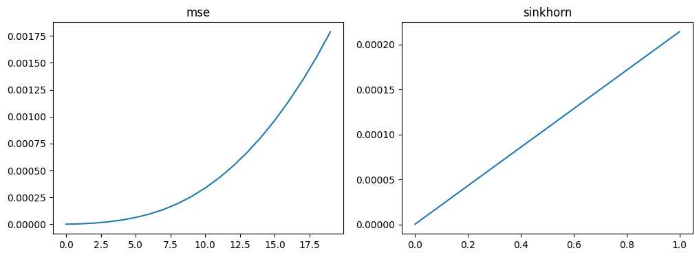
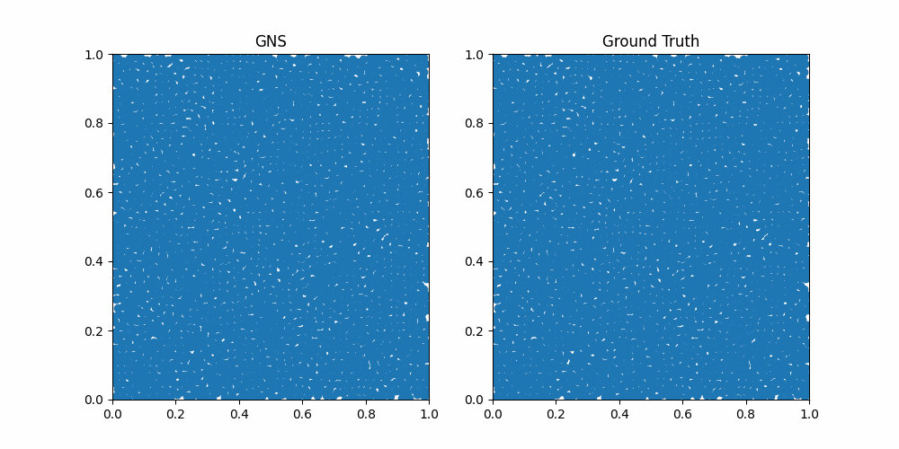

Training GNS on the 2D Taylor Green Vortex
==========================================

This tutorial notebook will show how to train a GNS model on the 2D
Taylor Green Vortex. It will give a brief overview of LagrangeBench on
these topics: - Datasets and case setup - Models - Training tricks and
strategies (random-walk noise and pushforward) - Training and inference

.. code:: ipython3

    import os
    os.environ["CUDA_VISIBLE_DEVICES"] = ""
    os.environ["JAX_ENABLE_X64"] = "True"
    
    import lagrangebench
    import haiku as hk
    import numpy as np
    import matplotlib.pyplot as plt
    import pickle
    import matplotlib.animation as animation

Datasets
--------

First thing to do is to load the dataset. The simplest way to do this is
by using e.g. the ``lagrangebench.data.TGV2D`` class for the
2-dimensional Taylor-Green vortex problem. It will automatically
download the HDF5 files if they are not found in the respective folder,
and it will take care of setting up the dataset. Note that for the
validation/test set you need to specify a positive number of rollout
steps, e.g. ``extra_seq_length=20``. This means that the dataset will
not split the trajectory into subsequences and keep whole rollouts for
evaluation.

.. code:: ipython3

    tgv2d_train = lagrangebench.data.TGV2D("train", extra_seq_length=5)  # extra_seq_length=5 will be clear later
    tgv2d_valid = lagrangebench.data.TGV2D("valid", extra_seq_length=20)
    
    print(
        f"This is a {tgv2d_train.metadata['dim']}D dataset "
        f"called {tgv2d_train.metadata['case']}.\n"
        f"Train snapshot have shape {tgv2d_train[0][0].shape} (n_nodes, seq_len, xy pos).\n"
        f"Val snapshot have shape {tgv2d_valid[0][0].shape} (n_nodes, rollout, xy pos).\n"
    )


.. parsed-literal::

    This is a 2D dataset called TGV.
    Train snapshot have shape (2500, 12, 2) (n_nodes, seq_len, xy pos).
    Val snapshot have shape (2500, 26, 2) (n_nodes, rollout, xy pos).
    


Similarly, for other datasets one can use the respective subclass, for
example

.. code:: python

   rpf_3d_data = lagrangebench.data.RPF3D("train") # 3D Reverse Poiseuille flow
   dam_2d_data = lagrangebench.data.DAM2D("train") # 2D Dam break
   # etc.
   # and in general: 
   lagrangebench.data.H5Dataset("train", dataset_path="path/to/dataset")

Models
------

All models should inherit from
```models.BaseModel`` </lagrangebench/models/base.py>`__, and generally
include a ``_transform`` function for feature engineering and graph
building.

Here we use a small GNS model, with latent dimension of 16 and 4 message
passing layers and predicting 2D accelerations. Note that we use a
function wrapper beause ``haiku.Modules`` must be initialized inside
``haiku.transform``.

.. code:: ipython3

    def gns(x):
        return lagrangebench.GNS(
            particle_dimension=tgv2d_train.metadata["dim"],
            latent_size=16,
            blocks_per_step=2,
            num_mp_steps=4,
            particle_type_embedding_size=8,
        )(x)

Then apply ``haiku.transform`` to the model function

.. code:: ipython3

    gns = hk.without_apply_rng(hk.transform_with_state(gns))

Training tricks and strategies
------------------------------

To improve performance and stabilize training we can use a number of
tricks and strategies. In this notebook we will cover random-walk noise
and pushforward, which are included by default in LagrangeBench.

Random-walk noise
~~~~~~~~~~~~~~~~~

Briefly, random-walk noise adds noise to the velocities in the input
sequence and adjusts the target positions accordingly. The standard
deviation is passed as a parameter, and each noise step is rescaled so
that the cumulated noise has the input standard deviation. It applied to
GNNs in physics in `“Learning to Simulate Complex Physics with Graph
Networks” <https://arxiv.org/abs/2002.09405>`__ by Deepmind (2020).

Pushforward
~~~~~~~~~~~

Instead of training always on the next step, the pushforward trick will
randomly sample a number of “unroll” steps to perform and compute the
loss only on the last one. Ideally this should inject the “right amount”
of noise, since it comes from the physical distribution. Because it adds
some overhead, the maximum number of unroll steps should not be too
large and the probability of unrolling large sequences should be
reasonably small. It comes from `“Message Passing Neural PDE
Solvers” <https://arxiv.org/pdf/2202.03376.pdf>`__ by J Brandstetter et
al. (2022).

.. code:: ipython3

    noise_std = 3e-4
    
    pf_config = lagrangebench.PushforwardConfig(
        steps=[-1, 500, 700],  # training steps to unlock the relative stage
        unrolls=[0, 2, 5],  # number of unroll steps per stage
        probs=[7, 2, 1],  # relative probabilities to unroll to the relative stage
    )

For example, this configuration would apply noise with ``std=3e-4`` and
pushforward with three unroll stages (0, 2 and 5), “unlocking” the
second stage after 500 training steps and the third stage after 700
training steps. After 700 steps, 0-step unroll (normal, 1-step training)
will happen with a probability of 70%, 2-step unroll with a probability
of 20% and finally 5-step unroll with a probability of 10%.

Pushforward up to 5 steps is the reason why we created the training
dataset as ``lagrangebench.data.TGV2D("train", extra_seq_length=5)``, as
or every sample from the dataset we need up to 5 steps of unroll.

Case
----

The ``CaseSetupFn`` is an essential part in LagrangeBench. Most of the
operations during training, such as data preprocessing, time integration
for the ouput and neighbor computation are managed by ``CaseSetupFn``.
The easies way to initialize it is through the
``lagrangebench.case_builder`` function.

.. code:: ipython3

    bounds = np.array(tgv2d_train.metadata["bounds"])
    box = bounds[:, 1] - bounds[:, 0]
    
    tgv2d_case = lagrangebench.case_builder(
        box=box,  # (x,y) array with the world size along each axis. (1.0, 1.0) for 2D TGV
        metadata=tgv2d_train.metadata,  # metadata dictionary
        input_seq_length=6,  # number of consecutive time steps fed to the model
        isotropic_norm=False,  # whether to normalize each dimension independently
        noise_std=noise_std,  # noise standard deviation used by the random-walk noise
    )

Training and inference
----------------------

Finally, to train GNS on Taylor Green (with noise and pushforward) the
``lagrangebench.Trainer`` methods comes to hand

.. code:: ipython3

    trainer = lagrangebench.Trainer(
        model=gns,
        case=tgv2d_case,
        data_train=tgv2d_train,
        data_valid=tgv2d_valid,
        pushforward=pf_config,
        noise_std=noise_std,
        metrics=["mse"],
        n_rollout_steps=20,
        eval_n_trajs=1,
        lr_start=5e-4,
        log_steps=100,
        eval_steps=500,
    )
    
    params, state, _ = trainer(step_max=1000)


.. parsed-literal::

    /home/ggalletti/git/lagrangebench/venv/lib/python3.10/site-packages/jax/_src/ops/scatter.py:94: FutureWarning: scatter inputs have incompatible types: cannot safely cast value from dtype=int64 to dtype=int32 with jax_numpy_dtype_promotion='standard'. In future JAX releases this will result in an error.
      warnings.warn("scatter inputs have incompatible types: cannot safely cast "


.. parsed-literal::

    0000, train/loss: 2.17808.
    0100, train/loss: 0.19394.
    0200, train/loss: 0.19751.
    0300, train/loss: 0.20027.
    0400, train/loss: 0.15017.
    0500, train/loss: 0.14875.
    {'val/loss': 0.006475041204928584, 'val/mse1': 3.5806455399026536e-06, 'val/mse5': 0.00014116973568971617, 'val/mse10': 0.0009921582776032162, 'val/stdloss': 0.0, 'val/stdmse1': 0.0, 'val/stdmse5': 0.0, 'val/stdmse10': 0.0}
    0600, train/loss: 0.02190.
    0700, train/loss: 1.62371.
    Reallocate neighbors list at step 772
    From (2, 21057) to (2, 20557)
    0800, train/loss: 0.18237.
    Reallocate neighbors list at step 804
    From (2, 20557) to (2, 20742)
    0900, train/loss: 0.01483.
    1000, train/loss: 0.19956.
    {'val/loss': 0.003817330574772867, 'val/mse1': 2.793629854284794e-06, 'val/mse5': 9.147089474639231e-05, 'val/mse10': 0.0005903546941926859, 'val/stdloss': 0.0, 'val/stdmse1': 0.0, 'val/stdmse5': 0.0, 'val/stdmse10': 0.0}


Now let’s see what the trained GNS can do. First, let’s get the test
data. As for the validation set, ``n_rollout_steps=20``.

.. code:: ipython3

    tgv2d_test = lagrangebench.TGV2D("test", extra_seq_length=20)

Then let’s run then evaluation over 20 timesteps. Here we use three
evaluation metrics: **position MSE** and **Sinkhorn** distance.

.. code:: ipython3

    metrics = lagrangebench.infer(
        gns,
        tgv2d_case,
        tgv2d_test,
        params,
        state,
        metrics=["mse", "sinkhorn"],
        eval_n_trajs=1,
        n_rollout_steps=20,
        rollout_dir="rollouts/",
        out_type="pkl",
    )["rollout_0"]
    rollout = pickle.load(open("rollouts/rollout_0.pkl", "rb"))

.. code:: ipython3

    # plot metrics
    fig, ax = plt.subplots(1, 2, figsize=(12, 4))
    
    # plot the metrics
    for i, m in enumerate(["mse", "sinkhorn"]):
        ax[i].plot(metrics[m])
        ax[i].set_title(m)





.. code:: ipython3

    print(f"rollout of shape {rollout['predicted_rollout'].shape} (steps, nodes, xy pos)")
    
    fig, ax = plt.subplots(1, 2)
    ax[0].set_xlim([0, 1.0])
    ax[0].set_ylim([0, 1.0])
    ax[1].set_xlim([0, 1.0])
    ax[1].set_ylim([0, 1.0])
    fig.set_size_inches(10, 5, forward=True)
    ax[0].set_title("GNS")
    ax[1].set_title("Ground Truth")
    
    rollout_len = rollout["predicted_rollout"].shape[0] - 1
    
    scat0 = ax[0].scatter(
        rollout["predicted_rollout"][0, :, 0], rollout["predicted_rollout"][0, :, 1]
    )
    scat1 = ax[1].scatter(
        rollout["ground_truth_rollout"][0, :, 0], rollout["ground_truth_rollout"][0, :, 1]
    )
    
    
    def animate(i):
        scat0.set_offsets(rollout["predicted_rollout"][i])
        scat1.set_offsets(rollout["ground_truth_rollout"][i])
        return scat0, scat1
    
    
    ani = animation.FuncAnimation(
        fig, animate, repeat=True, frames=rollout_len, interval=50
    )
    
    plt.close(fig)
    
    writer = animation.PillowWriter(fps=10, metadata=dict(artist="Me"), bitrate=1800)
    ani.save("media/scatter.gif", writer=writer)
    
    from IPython.display import Image
    
    Image(url="media/scatter.gif")


.. parsed-literal::

    rollout of shape (26, 2500, 2) (steps, nodes, xy pos)



